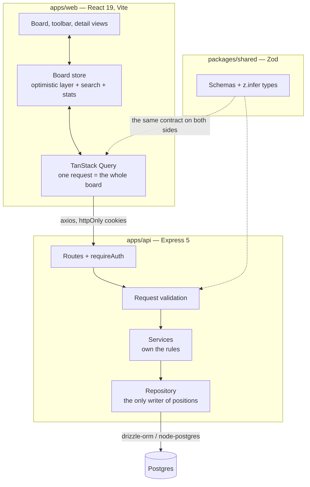

# Trackr

A job-application kanban board. Drag a card from Applied to Interview, write a
note on it, watch the pipeline.

## The problem

I was tracking applications in a spreadsheet and losing track. Which company I
had heard back from, what stage each application was really at, when I last
followed up - it ended up scattered across a dozen tabs and one filter I never
remembered to clear. A spreadsheet is good at storing rows and bad at showing
state. The question I actually had every morning was "what is my pipeline right
now", and nothing on that screen answered it.

So I built the thing I kept trying to fake with keyboard shortcuts and saved
filter views: a board where the column a card sits in _is_ its status.

<!--
TODO(record): drop the screen recording at assets/board-drag.gif — it should show
a card being dragged out of one column and into another, overlay and all.
To record: `pnpm dev`, sign in, then capture the browser window while dragging a
card. To convert on macOS (ffmpeg via `brew install ffmpeg`):

  ffmpeg -i capture.mov -vf "fps=15,scale=960:-1:flags=lanczos" assets/board-drag.gif

Keep it under ~4MB so the README still renders on a phone.
-->


## What it does

- **A four-column board** : Applied → Interview Scheduled → Offer → Rejected.
  Cards drag within and between columns, and the order you leave them in is the
  order you get back.
- **Notes on every card**: recruiter emails, interview feedback, reminders, on a
  newest-first timeline.
- **A silence badge**: a card with no movement and no note for seven days is
  flagged, so a forgotten application is visible rather than remembered.
- **Live search** across company, role and location.
- **A stats page**: weekly application volume, a funnel by stage, and the cards
  that have gone quiet.
- **CSV export** of the whole board, in board order.
- **A phone layout**: one column per screen with a tab strip, a bottom sheet for
  details, and long-press to move a card.
- **Dark and light**, and a card is linkable: `/dashboard?open=<id>`.

## Architecture



Three rules hold the shape of it together:

1. **One request per board.** There is no per-card fetch, so the columns and the
   cards can never be out of step with each other.
2. **One owner of ordering.** `application.repository.ts` is the only module
   that may produce a position. Everywhere else consumes an id list.
3. **One contract.** Every request and response is a Zod schema in
   `packages/shared`, with the TypeScript types inferred beside it by `z.infer`,
   so the API's validation and the web's types cannot drift.

Sessions are JWTs in `httpOnly` cookies — never in JavaScript. The refresh token
is stored only as a SHA-256 hash and its cookie is scoped to `/auth`, and the
client has a single-flight refresh queue so ten parallel 401s produce one refresh
call.

## Stack

|               |                                                                     |
| ------------- | ------------------------------------------------------------------- |
| Web           | React 19, TypeScript 6, Vite 8, TanStack Router + Query 5           |
| Drag and drop | `@dnd-kit` 0.5 (`react` + `helpers`)                                |
| UI            | Tailwind CSS 4, Base UI, shadcn, Hugeicons, `next-themes`, `sonner` |
| API           | Express 5, Zod 4, JWT + bcrypt, nodemailer                          |
| Database      | Postgres via `drizzle-orm` + `node-postgres`                        |
| Tests         | Vitest 5 across three projects                                      |
| Workspace     | pnpm workspaces                                                     |

## Running it locally

```bash
pnpm install

cp apps/api/.env.example apps/api/.env   # DATABASE_URL, JWT_SECRET
cp apps/web/.env.example apps/web/.env   # VITE_API_URL, VITE_SITE_NAME

pnpm --filter api db:migrate:local
pnpm dev                                # shared build + web + api
```

Then open http://localhost:5173 and sign up.

Other scripts: `pnpm test` (all three projects), `pnpm test:api`, `pnpm build`.

## Tests

`pnpm test` runs three Vitest projects — `api`, `web` and `shared`. The shared
project also typechecks its own suites, so the `z.infer` types and the request
contracts are verified rather than assumed.

- **`shared`** — every schema: what it accepts and, mostly, what it refuses.
- **`api`** — service and controller units against a hand-written fake
  repository, plus integration tests against a real Postgres. The setup refuses
  to run unless the database name ends in `_test`.
- **`web`** — the CSV writer: quoting and embedded commas, note ordering, board
  order, the filename. The stats derivations in `lib/analytics.ts` are pure
  functions of the board as well and are the obvious next thing to cover.

## Layout

```
apps/web          React app — board, stats, auth screens
apps/api          Express API — auth, applications, notes
packages/shared   Zod contracts shared by both
```
